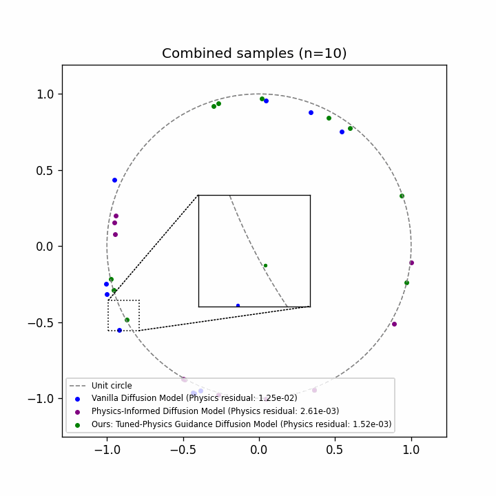

# Tuned-Physics Guidance: Physics-Informed Guidance for Diffusion Models





This repository demonstrates **guidance** between a physics-informed diffusion model and a purely data-driven (reconstruction-only) diffusion model.  
Guidance gives you continuous control over the trade-off between **sample diversity** and **physics consistency**.

The code supports two illustrative problems:

1. **Toy hypersphere** – 2-D points constrained to the unit circle.  
2. **Darcy flow** – steady-state pressure & permeability fields governed by Darcy's equation.

Both follow the same workflow:

1. Install dependencies
2. Download (or generate) data
3. (Optionally) download pretrained checkpoints
4. Train the two constituent models
5. Sample with physics guidance
6. Plot / visualise results

---
## 1. Installation
```bash
# Clone the repo
 git clone https://github.com/shivamudide/TunedPhysicsGuidance.git
 cd TunedPhysicsGuidance

# Install python packages (python ≥3.9)
 pip install -r requirements.txt
```
The code automatically uses a CUDA device if one is available.

---
## 2. Data
### 2.1 Darcy flow
1. Download the prepared datasets from the ETH Research Collection:  
   https://www.research-collection.ethz.ch/handle/20.500.11850/674074
2. Extract to the following layout (create folders if needed):
```
TunedPhysicsGuidance/
└── data/
    └── darcy/
        ├── train/
        │   ├── p_data.csv
        │   └── K_data.csv
        └── valid/
            ├── p_data.csv
            └── K_data.csv
```
The scripts will abort with a clear error message if a file is missing.

### 2.2 Toy hypersphere
The toy problem is **synthetic** – data are generated on-the-fly, so there is nothing to download.

---
## 3. Pre-trained checkpoints (optional)
If you only want to experiment with guided sampling you can skip training and download the ready-made checkpoints. Download the checkpoints from the following link: https://drive.google.com/drive/folders/19VsnP2gdaOwPqZSEaWp4-bORg6zEwUpM?usp=sharing
Follow the below directory structure:
```
trained_models/
├── darcy/
│   └── PIDM-ME/             # physics-informed model (provided)
├── darcy_recon_only/     # recon-only model (≈10 MB)
├── toy/
│   ├── run_1/           # physics-informed toy model
│   └── recon_only/      # recon-only toy model
```
Unzip the archives so that the contained `model/checkpoint_*.pt` files sit directly inside each directory.

If you prefer to **train from scratch**, follow the next section.

---
## 4. Training
### 4.1 Toy hypersphere
Run a script that trains the recon-only model:
```bash
python train_toy_models.py
```
• Checkpoint is written to 'trained_models/toy/recon_only/model/'

Run a script that trains the physics-informed model:
```bash
python main.py
```
• Checkpoint is written to 'trained_models/toy/run_1/model/'

### 4.2 Darcy flow
The physics-informed checkpoint (`trained_models/darcy/PIDM-ME`) is already provided.  
Train the reconstruction-only model with:
```bash
python train_recon_only.py
```
Training progress can be monitored in a separate terminal:
```bash
python monitor_training.py \
  --model_dir ./trained_models/recon_only \
  --total_iterations 10000
```
Checkpoints are saved in `trained_models/recon_only/model/`.

---
## 5. Guided sampling
### 5.1 Toy hypersphere
Generate 1 000 guided samples with guidance weight ω=0.7:
```bash
python sample_toy_guided.py \
  --physics_model_path ./trained_models/toy/run_1 \
  --recon_model_path   ./trained_models/toy/recon_only \
  --physics_model_step 400 \
  --recon_model_step   400 \
  --omega 0.7 \
  --n_samples 1000 \
  --output_dir ./toy_guided_samples \
  --create_gif            # (optional) produces guided_trajectory.gif
```
CSV files of the raw samples plus `circular_samples.png` are written to `toy_guided_samples/`.

### 5.2 Darcy flow
Produce 4 guided pressure/permeability fields with guidance_scale = 1.3:
```bash
python sample_guided.py \
  --physics_model_path ./trained_models/darcy/PIDM-ME \
  --recon_model_path   ./trained_models/recon_only \
  --physics_model_step 300000 \
  --recon_model_step   10000 \
  --guidance_scale 1.3 \
  --post_correction_iters 100 \
  --n_samples 4 \
  --schedule cosine \
  --output_dir ./guided_samples \
  --create_gif           # (optional) GIFs of the denoising trajectory
```
This stores per-sample CSVs and PNGs in `guided_samples/physics_300000_recon_10000_guidance_1.3/`.

---
## 6. Plotting utilities
Several helper scripts are provided for visualisation:

• `make_combined_circular_gif.py` – animates toy samples from the three methods.  
• `sweep_guidance_toy.py` – sweeps ω and plots residual MAE/MSE curves.  

All scripts write their figures/GIFs into the working directory by default.

---
### Citation
This repo builds on the work of *Jan-Hendrik Bastek, WaiChing Sun, Dennis M. Kochmann, "Physics-Informed Diffusion Models", arXiv:2403.14404 (2023)* which is available at https://github.com/jhbastek/PhysicsInformedDiffusionModels.
	